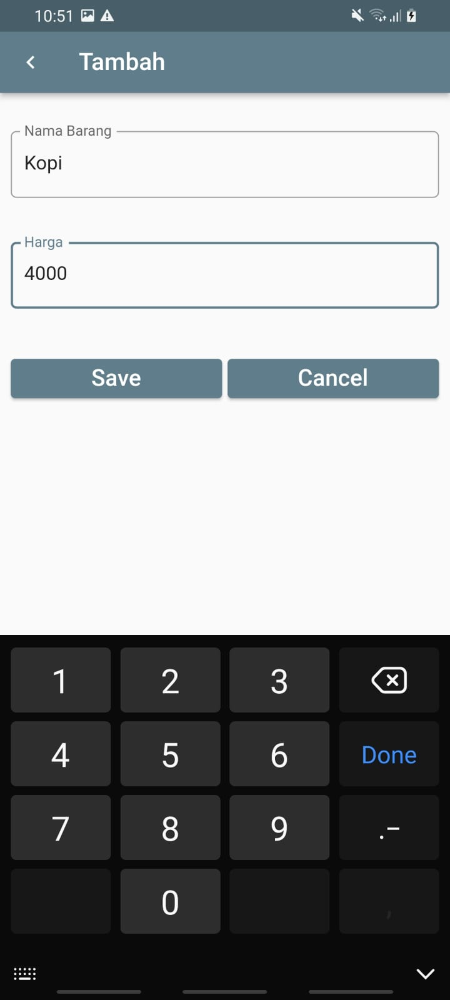
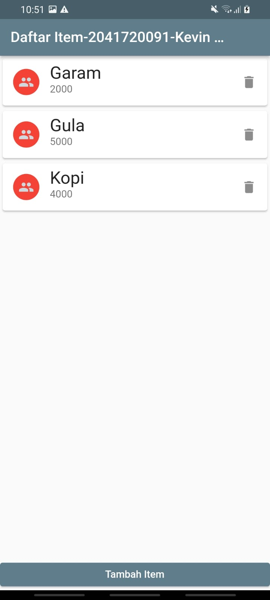

# flutter_sqflite

Nama:Kevin Natanael Wijaya  
Kelas:TI-3B  
NIM:2041720091  
  
Tampilan Awal:  
  
Tambah Data Garam:  
  
Hasil Daftar:  
  
Tambah Data Gula:  
  
Hasil Daftar:  
  
Tambah Data Kopi:  
  
Hasil Daftar:  
  
Edit Data Kopi:  
  
Hasil Daftar:  
  
Hapus Data Kopi:  
  
